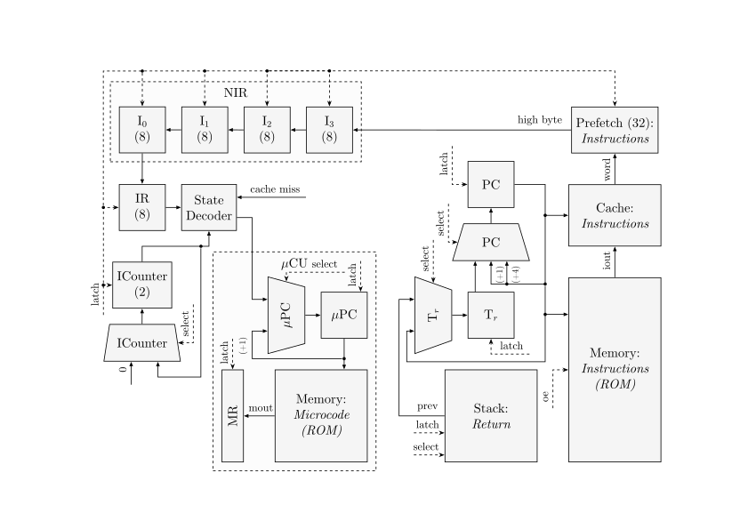
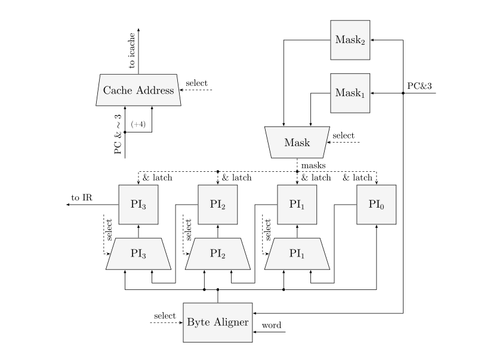
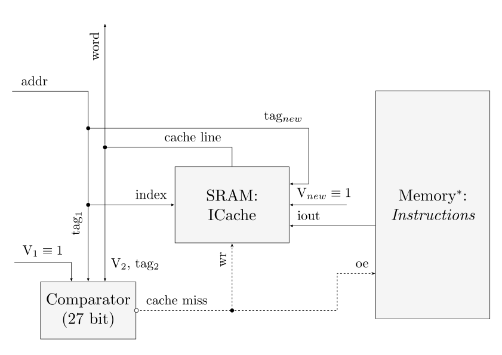
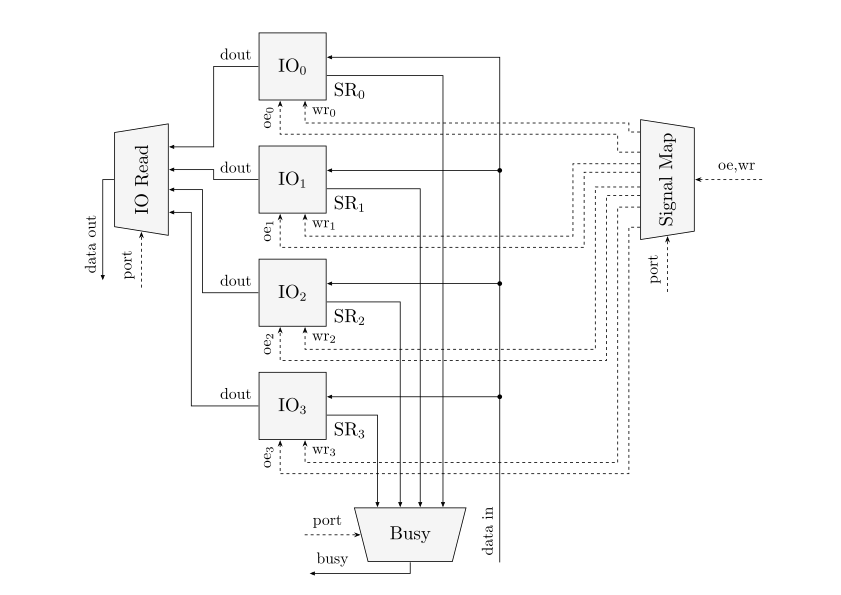
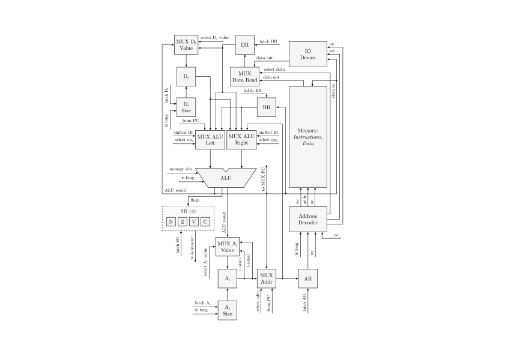

# StackFlowy

- Студент: Лабин Макар Андреевич, P3231, 466449.
- `asm | stack | harv | mc | tick | binary | stream | port | cstr | prob2 | cache`

## Язык программирования

### Синтаксис языка

Синтаксис строится вокруг явной декларации трансформации вершины стека. Каждая базовая инструкция описывает, какие данные извлекаются _(слева от двоеточия)_ и какие помещаются обратно _(справа от двоеточия)_.

Синтаксис в расширенной форме Бэкуса — Наура:

- [ ... ] — вхождение 0 или 1 раз
- { ... } — повторение 0 или несколько раз
- ( ... ) — группировка

```
program = { statement } ;

statement = instruction
          | preprocessor_directive
          | label_definition
          | comment ;

label_definition = label_name ":" ;

instruction = stack_push_instr
            | stack_pop_instr
            | stack_dup_instr
            | stack_swap_instr
            | stack_binary_instr
            | stack_unary_instr
            | mem_io_load_instr
            | mem_io_store_instr
            | control_flow_instr
            | flag_instr
            | nop_instr ;

stack_push_instr   = "(" ":" arg_value ")" ;
stack_pop_instr    = "(" identifier ":" ")" ;
stack_dup_instr    = "(" identifier ":" identifier "," identifier ")" ;
stack_swap_instr   = "(" identifier "," identifier ":" identifier "," identifier ")" ;
stack_binary_instr = "(" identifier "," identifier ":" identifier binary_op_token identifier ")" ;
stack_unary_instr  = "(" identifier ":" unary_op_token identifier ")" ;

mem_io_load_instr  = "(" identifier ":" identifier ")" "<=" ( "MEM_DATA" | "IN" ) ;
mem_io_store_instr = "(" identifier "," identifier ":" ")" "=>" ( "MEM_DATA" | "OUT" ) ;

control_flow_instr = "<" [ "?" | "!" ] label_name ">"
                   | "<" "RET" ">"
                   | "<" "..." ">" ;

flag_instr         = "(" identifier ":" ")" "=>" "FLG"
                   | "(" ":" identifier ")" "<=" "FLG" ;
nop_instr          = "(" ":" ")" ;

binary_op_token    = "+" | "-" | "*" | "/" | "&" | "|" | "^" | "==" | ">" | "<" | ">=" | "<=" ;
unary_op_token     = "~" | "-" | "<<" | ">>" ;

preprocessor_directive = define_directive
                       | macro_definition
                       | macro_call
                       | conditional_compilation ;

define_directive = "@define" identifier ( arg_value | identifier ) ;

macro_definition = "@macro" identifier "(" [ macro_def_params ] ")" "{" program "}" ;
macro_def_params = identifier { "," identifier } ;

macro_call       = "$" identifier "(" [ macro_call_args ] ")" ;
macro_call_args  = argument { "," argument } ;
argument         = arg_value | identifier ;

conditional_compilation = "@if" "(" condition ")" "{" program "}" 
                          { "@elif" "(" condition ")" "{" program "}" } 
                          [ "@else" "{" program "}" ] ;

constant_reference    = "$" identifier ;
macro_param_reference = "%" identifier ;
label_name            = "_" ( letter | digit | "_" ) { letter | digit | "_" } ;

condition  = expression ;
expression = cond_value cond_binary_op cond_value ;
cond_binary_op  = "==" | "!=" ;
cond_value = number | constant_reference ;

arg_value = number 
          | constant_reference 
          | macro_param_reference
          | label_name ;

identifier = letter { letter | digit | "_" } ;
number     = [ "-" ] decimal_num | hex_num ;
decimal_num = digit { digit } ;
hex_num     = ( "0x" | "0X" ) hex_digit { hex_digit } ;
comment    = ";" { character } ;

letter = "a" | "b" | "c" | "d" | "e" | "f" | "g" | "h" | "i" | "j" | "k" | "l" | "m" 
       | "n" | "o" | "p" | "q" | "r" | "s" | "t" | "u" | "v" | "w" | "x" | "y" | "z" 
       | "A" | "B" | "C" | "D" | "E" | "F" | "G" | "H" | "I" | "J" | "K" | "L" | "M" 
       | "N" | "O" | "P" | "Q" | "R" | "S" | "T" | "U" | "V" | "W" | "X" | "Y" | "Z" ;
       
digit = "0" | "1" | "2" | "3" | "4" | "5" | "6" | "7" | "8" | "9" ;
hex_digit = digit 
          | "a" | "b" | "c" | "d" | "e" | "f" 
          | "A" | "B" | "C" | "D" | "E" | "F" ;
character = ? любой печатный символ или пробел до конца строки ? ;
```

Также язык обладает своей системой макрокоманд и препроцессинга.

#### Директивы подстановки

> `@define <key> <value>` — объявляет глобальную константу или псевдоним.

- **Синтаксис вызова**: `$key`.
- **Назначение**: Определение адресов портов, магических чисел или адресов памяти.

> `@macro <name>(<params>) { <body> }` — определяет шаблон кода, который будет развернут при вызове.

- **Параметры**: Внутри тела макроса обращение к аргументам идет через префикс `%` (например, `%addr`).
- **Синтаксис вызова**: `$name(arg1, arg2, ...)`.
- **Особенности**: Препроцессор выполняет прямую подстановку текста. Для предотвращения коллизий меток внутри макросов рекомендуется использовать локальные для макроса имена.

#### Условная компиляция

Позволяет управлять составом результирующего кода на этапе сборки. Все условия вычисляются препроцессором, а не процессором во время выполнения:

```asm
@if (condition) {
    ; блок кода 1
} 
@elif (condition) {
    ; блок кода 2
} 
@else {
    ; блок кода 3
}
```

### Семантика языка

#### Стратегия вычислений

В языке используется **строгая модель вычислений** с последовательным выполнением инструкций. Процессор является стековой машиной, где все операнды должны быть подготовлены на стеке до момента вызова команды.

С точки зрения синтаксических границ и семантики, набор команд строго разделен на **три цельные формы**. Каждая форма определяет свои правила взаимодействия со стеком:

1. `( А : Б )`

Синтаксис этих команд ограничен только круглыми скобками. Они работают исключительно внутри процессора (со стеком данных и регистром флагов `SR`).

2. `( А : Б ) <= ИСТОЧНИК` или `( А : Б ) => ПРИЁМНИК`

Стрелка и внешняя сущность здесь являются частью синтаксиса команды, которая определяет её семантику.

3. `< [модификатор] ЦЕЛЬ >`

Эти команды используют угловые скобки как маркер немедленного «действия» или изменения контекста. Они не имеют скобочной структуры `( : )` и работают напрямую со счетчиком команд `PC` и/или стеком возвратов.

#### Области видимости

- **Глобальная**: Доступна на протяжении всего исходного файла. Включает в себя метки переходов (например, `_main:`), макросы, объявленные через `@macro`, и константы препроцессора (`@define`).

- **Локальная (уровень макроса)**: Ограничивается телом конкретного макроса `{ ... }`. Включает в себя:
  - Аргументы макроса, к которым происходит обращение через префикс `%` (например, `%addr`).
  - Локальные метки переходов. Чтобы избежать конфликтов и коллизий имён при многократном вызове одного и того же макроса, препроцессор изолирует их пространство имён, автоматически добавляя к каждой внутренней метке уникальный суффикс с номером вызова (например, `_loop` преобразуется в `_loop_1`).

- **Символическая (уровень инструкции)**: Идентификаторы внутри круглых скобок `( a, b : a + b )` не выделяют память и не создают переменных. Они существуют только в рамках одной строки как алиасы для документирования и указания компилятору, какие операции применить к снимаемым со стека значениям.

#### Типизация
Язык является _бестиповым_. Вся информация в стеке, памяти и портах интерпретируется как нетипизированное машинное слово фиксированной длины (целое число).

Трактовка значения зависит исключительно от применяемой к нему инструкции:

- Операции условного перехода трактуют вершину стека как булево значение _(`0` — ложь, любое другое значение — истина)_.
- Операции сравнения _(`==`, `<`, `>`)_ трактуют два верхних значения стека как знаковые числа.

#### Виды литералов

- **Целочисленные литералы:** используются для констант и адресов. Поддерживаются десятичный и шестнадцатеричный форматы. Они транслируются в инструкцию при помощи непосредственной адресации и размещаются прямо в памяти инструкций. При сохранении в памяти целочисленные значения кодируются в формате Little-Endian.

- **Строковые литералы:** записываются в двойных кавычках `"Text"`. Разрешены только в секциях данных. При компиляции строка разворачивается в последовательный массив ASCII-кодов символов, который завершается нуль-терминатором (`\0`). Символы строки сохраняются в памяти в формате Big-Endian для удобства чтения.

## Организация памяти

Система разделена на независимые пространства однопортовой памяти на базе Гарвардской архитектуры: память данных и память инструкций, последняя работает в связке с кешем инструкций.

### Память данных

* **Разрядность машинного слова:** 32 бита (4 байта).
* **Тип адресации:** Линейная побайтовая. Каждая ячейка памяти хранит ровно 1 байт информации, допускается невыровненный доступ к данным.
* **Порядок байт:** Little-Endian. 
    * *Запись:* 32-битное значение из тракта данных аппаратно разбивается на 4 байта и последовательно записывается в ячейки `[Td, Td+1, Td+2, Td+3]`.
    * *Чтение:* Чтение инициирует выборку 4 последовательных байт, начиная с адреса, указанного в регистре `Td`, которые собираются в единое машинное слово.

### Память инструкций

* **Разрядность машинного слова:** 32 бита (4 байта).
* **Тип адресации:** Побайтовая на уровне хранения, но с принудительным аппаратным выравниванием на границу слова при чтении.
* **Порядок байт:** Little-Endian.
    * При выборке строки из памяти инструкций для заполнения кэш-линии адрес выравнивается комбинационной логикой по 4-байтовой границе (`PC & ~3`).
    * Буфер предвыборки инструкций, который включает в себя 4 индивидуальные байтовых ячейки, заполняется данными из кеша инструкций.
    * Запись новых инструкций напрямую через процессор не допускается в рамках Гарвардской архитектуры.

### Регистры

Процессор является стековой машиной, поэтому традиционные регистры общего назначения отсутствуют. Программисту доступны:

1. **Стек данных:**
- Аппаратный стек на базе двунаправленных сдвиговых регистров для хранения локальных данных, операндов и результатов вычислений.
- Размер стека - 16 ячеек суммарно.
- Верхние элементы стека представлены регистрами `Td` (вершина) и `S` (второй элемент).

2. **Стек возвратов:**
- Изолированный аппаратный стек на базе двунаправленных сдвиговых регистров для хранения адресов возврата из процедур.
- Доступен косвенно через команды ветвления.
- Размер стека - 16 ячеек суммарно.
- Верхний элемент представлен регистром `Tr`

3. **Регистр флагов:**
- Хранит флаги `V` и `C`.
- Доступен косвенно через математические операции.
- Доступен напрямую через команды `PUSHF` / `POPF`.

4. **Счетчик команд:**
- Управляется инструкциями ветвления.
- Доступен косвенно через операции перехода.

5. **Память инструкций:**
- Хранит исполняемый код.

6. **Кеш инструкций:**
- Кеш прямого отображения.
- Размер кеша — 16 линий.
- Формат кеш-линии см. [Кеш инструкций](#кеш-инструкций).

7. **Память данных:**
- Хранит статические данные.

8. **Порты ввода-вывода:**
- Доступны через инструкции IN и OUT.
- Реализовано побайтовое чтение/запись

### Схема адресного пространства

```
              Память инструкций                         Память данных 
+------------------------------+      +------------------------------+
| 0x0000 : JMP _main           |      | (Секция .data@ 0x1000)       |
| ...                          |      | 0x1000 : 'H' (Абс. адрес)    |
| 0x0020 : PUSH 10             |      | 0x1001 : 'e'                 |
| 0x0025 : ADD                 |      | 0x1002 : 'l'                 |
| ...                          |      | 0x1003 : 'l'                 |
| addr   : Начало процедуры    |      | 0x1004 : 'o'                 |
| ...                          |      | 0x1005 : '\0'                |
| addr_N : HALT                |      | ...                          |
+------------------------------+      | 0x2000 : 0x000001F4 (500)    |
                                      | ...                          |
                                      +------------------------------+
```

### Кеш инструкций

Для снижения задержек при обращении к относительно медленной памяти инструкций в архитектуре процессора используется **кеш прямого отображения** на 16 строк. Каждая строка кеша хранит ровно одно 32-битное машинное слово.

#### Разметка адреса для кеширования

32-битный адрес разделяется на три функциональные зоны для адресации и верификации данных в кеше:

```
| 31 ....................................... 6 | 5  4  3  2 | 1  0 |
|----------------------------------------------|------------|------|
|                      ТЕГ                     |   ИНДЕКС   | СМЕЩ.|
|                   26 битов                   |   4 бита   |2 бита|
```

* **Смещение:** используется для байтовой адресации внутри 32-битного машинного слова.
* **Индекс:** определяет одну из 16 строк кеша, в которую может быть отображён данный адрес.
* **Тег:** хранит старшие биты адреса для однозначной идентификации того, какая именно инструкция из памяти инструкций сейчас находится в выбранной строке кеша.

#### Структура строки кеша

Физическая структура одной строки кеша имеет общую разрядность 59 битов и включает в себя следующие поля:

```
+-----------+----------------------+----------------------------------+
| V (1 бит) |    TAG (26 битов)    |          WORD (32 бита)          |
+-----------+----------------------+----------------------------------+
```
* **V:** флаг валидности:
  - `0` — строка пуста;
  - `1` — строка содержит актуальные данные.
* **TAG:** значение тега считанного адреса.
* **WORD:** машинное слово, загруженное из памяти команд.

### Механика отображения программы и данных на процессор

Процессор поддерживает два основных вида адресации:

- **Непосредственная адресация**:
  - Значение константы или адреса зашито прямо в тело 5-байтовой инструкции.

- **Косвенная адресация через стек**:
  - Адрес целевой ячейки памяти данных или порта находится на вершине стека данных.

#### Работа с константами

Константы, которые объявлены через директиву препроцессора `@define <identifier> <number>`, не выделяют память ни в основной памяти, ни в стеке. На этапе препроцессинга транслятор заменяет все вхождения идентификатора на его числовое значение.

#### Работа с переменными

Так как процессор является стековым и не имеет регистров общего назначения, то концепция классических переменных здесь отсутствует.

#### Работа с процедурами

Процедуры компилируются как последовательный код в памяти инструкций, указатели на них встраиваются в команды перехода и сохраняются в памяти инструкций при помощи непосредственной адресации.

## Система команд

Архитектура использует команды переменной длины, которые кодируются следующим образом:

- **1 байт** — инструкции без операндов-констант;
- **5 байт** — инструкции, которые используют встроенную константу или адрес _(1 байт код операции + 4 байта операнд)_.

### Набор инструкций

| Синтаксис | Инструкция | IF | AF | EX | ALL | Описание | V | C |
| :--- | :--- | :---: | :---: | :---: | :---: | :--- | :---: | :---: |
| `( : val )` | `PUSH val` | 3/13 | 1/11 | 1 | 5/25 | Кладёт 4-байтовую константу на вершину стека. | - | - |
| `( a : )` | `POP` | 3/13 | - | 1 | 4/14 | Удаляет верхний элемент со стека. | - | - |
| `( a : a, a )` | `DUP` | 3/13 | - | 1 | 4/14 | Читает значение с вершины стека и кладет его копию поверх. | - | - |
| `( a, b : b, a )` | `SWAP` | 3/13 | - | 1 | 4/14 | Меняет местами два верхних элемента стека. | - | - |
| `( a, b : a + b )` | `ADD` | 3/13 | - | 1 | 4/14 | Извлекает два элемента, складывает их, результат на стек. | + | + |
| `( a, b : a - b )` | `SUB` | 3/13 | - | 1 | 4/14 | Вычитает верхний элемент из второго сверху. | + | + |
| `( a, b : a * b )` | `MUL`$^*$ | 3/13 | - | 1 | 4/14 | Знаковое умножение двух элементов стека, сохраняет младшее слово результата. | + | + |
| `( a, b : a / b )` | `DIV`$^*$ | 3/13 | - | 1 | 4/14 | Знаковое целочисленное деление второго элемента стека на верхний. | + | + |
| `( a, b : a & b )` | `AND` | 3/13 | - | 1 | 4/14 | Побитовое И. | - | - |
| `( a, b : a \| b )` | `OR` | 3/13 | - | 1 | 4/14 | Побитовое ИЛИ. | - | - |
| `( a, b : a ^ b )` | `XOR` | 3/13 | - | 1 | 4/14 | Побитовое исключающее ИЛИ. | - | - |
| `( a : ~a )` | `NOT` | 3/13 | - | 1 | 4/14 | Побитовое отрицание (инверсия). | - | - |
| `( a, b : a == b )` | `EQ` | 3/13 | - | 1 | 4/14 | Знаковое сравнение ==. Кладет `1` (истина) или `0` (ложь) на стек. | - | - |
| `( a, b : a > b )` | `GT` | 3/13 | - | 1 | 4/14 | Знаковое сравнение >. Кладет `1` (истина) или `0` (ложь) на стек. | - | - |
| `( a, b : a < b )` | `LT` | 3/13 | - | 1 | 4/14 | Знаковое сравнение <. Кладет `1` (истина) или `0` (ложь) на стек. | - | - |
| `( a, b : a >= b )` | `GEQ` | 3/13 | - | 1 | 4/14 | Знаковое сравнение >=. Кладет `1` (истина) или `0` (ложь) на стек. | - | - |
| `( a, b : a <= b )` | `LEQ` | 3/13 | - | 1 | 4/14 | Знаковое сравнение <=. Кладет `1` (истина) или `0` (ложь) на стек. | - | - |
| `( a : -a )` | `NEGATE` | 3/13 | - | 1 | 4/14 | Арифметическое отрицание (изменение знака). | - | - |
| `( a : <<a )` | `SHLT` | 3/13 | - | 1 | 4/14 | Логический сдвиг влево на 1 бит. | - | - |
| `( a : >>a )` | `SHRT` | 3/13 | - | 1 | 4/14 | Логический сдвиг вправо на 1 бит. | - | - |
| `( addr : val ) <= MEM_DATA` | `LOAD` | 3/13 | - | 10 | 13/23 | Извлекает адрес, читает машинное слово из памяти, кладет его на стек. | - | - |
| `( val, addr : ) => MEM_DATA`| `STORE` | 3/13 | - | 10 | 13/23 | Извлекает адрес и значение. Пишет значение по указанному адресу в память. | - | - |
| `( port : val ) <= IN` | `IN` | 3/13 | - | 10 | 13/23 | Читает значение из порта (номер порта извлечён со стека) и кладет на стек. | - | - |
| `( val, port : ) => OUT` | `OUT` | 3/13 | - | 10 | 13/23 | Записывает снятое со стека значение в указанный (также снятый) порт. | - | - |
| `<LABEL>` | `JMP addr` | 3/13 | 1/11 | 1 | 5/25 | Безусловный переход. Записывает адрес `LABEL` в регистр `PC`. | - | - |
| `<? LABEL>` | `CJMP addr`| 3/13 | 1/11 | 1 | 5/25 | Снимает значение со стека. Если оно не равно `0`, переходит по адресу `LABEL`. | - | - |
| `<! LABEL>` | `CALL addr` | 3/13 | 1/11 | 1 | 5/25 | Сохраняет адрес следующей инструкции в стек возвратов. Переход на `LABEL`. | - | - |
| `<RET>` | `RET` | 3/13 | - | 1 | 4/14 | Извлекает адрес из стека возвратов и помещает его в `PC`. | - | - |
| `( flags : ) => FLG` | `POPF` | 3/13 | - | 1 | 4/14 | Снимает значение со стека и устанавливает его в регистр флагов `SR`. | + | + |
| `( : flags ) <= FLG` | `PUSHF` | 3/13 | - | 1 | 4/14 | Копирует текущее состояние `SR` и помещает на стек. | - | - |
| `( : )` | `NOP` | 3/13 | - | 1 | 4/14 | Пустая операция, процессор ничего не делает. | - | - |
| `<...>` | `HALT` | 3/13 | - | 1 | 4/14 | Остановка выполнения программы. | - | - |

**Пояснения к таблице:**

- IF — количество тактов на выборку кода инструкции из памяти команд.

- AF — количество тактов на чтение операндов / аргументов (из стека данных или памяти).

- EX — количество тактов на непосредственное выполнение операции в АЛУ или управляющем автомате.

- ALL — суммарное количество тактов, необходимое для полной обработки инструкции.

- Через `/` указаны значения в случае cache hit и cache miss соответственно.

\* — упрощение в рамках условия лабораторной работы: реализация машинной арифметики на уровне схем опущена, операции выполняются в АЛУ «как бы» за один такт.

### Уровень микроинструкций

Управление компонентами процессора осуществляется с помощью **микропрограммного управления**. Каждая машинная инструкция процессора не выполняется аппаратно напрямую, а интерпретируется как последовательность микроинструкций. 

#### Хранение и структура микрокода

- Микрокод изолирован от основной памяти программ и данных. 

- В каждый такт по растущему фронту синхросигнала текущая микроинструкция загружается в регистр микрокоманды `MR`. Выходы этого регистра жестко разведены к управляющим входам всех мультиплексоров, регистров, памяти и АЛУ.

- Используется _горизонтальный микрокод_. Микрокоманда представляет собой 37-битное машинное слово, разделенное на логические поля управления.

```
┌───────┬────────────┬───────────┬───────┬───────┬───────┬───────┬───────┬───────┐
│ 36-31 │   30-23    │   22-19   │ 18-16 │ 15-14 │ 13-12 │ 11-09 │ 08-05 │ 04-00 │
├───────┼────────────┼───────────┼───────┼───────┼───────┼───────┼───────┼───────┤
│  ALU  │ STACK_DATA │ STACK_RET │  PC   │  SR   │  MEM  │  I/O  │  SEQ  │ MICRO │
└───────┴────────────┴───────────┴───────┴───────┴───────┴───────┴───────┴───────┘
```

_Расшифровка битовых полей:_

* `ALU`, 6 бит:
  - Код операции, _4 бита_ (16 значений):
  > `add`, `sub`, `mul`, `div`, `negate`, `and`, `or`, `xor`, `not`, `shlt`, `shrt`, `eq`, `gt`, `lt`, `geq`, `leq`
  - Маршрутизация левого операнда, _1 бит_ (2 значения):
  > `0`, `S`
  - Маршрутизация правого операнда, _1 бит_ (2 значения):
  > `Td`, `SR`
* `STACK_DATA`, 8 бит:
  - Защёлка стека, _1 бит_
  - Защёлка регистра `S`, _1 бит_
  - Защёлка регистра `Td`, _1 бит_
  - Маршрутизация стека с регистром `S`, _2 бита_ (3 значения):
  > `prev`, `prev_two`, `next`
  - Маршрутизация регистра `Td`, _3 бита_ (5 значений):
  > `s`, `data_stack`, `alu_res`, `i_prefetch`, `data_read`
* `STACK_RET`, 4 бита:
  - Защёлка стека, _1 бит_
  - Защёлка регистра `Tr`, _1 бит_
  - Маршрутизация стека, _1 бит_ (2 значения):
  > `prev`, `next`
  - Маршрутизация регистра `Tr`, _1 бит_ (2 значения):
  > `prev`, `pc+4`
* `PC`, 3 бита:
  - Защёлка регистра `PC`, _1 бит_
  - Маршрутизация регистра `PC`, _2 бита_ (4 значения):
  > `i_prefetch`, `tr`, `+1`, `+4`
* `SR`, 2 бита:
  - Защёлка регистра `SR`, _1 бит_
  - Маршрутизация регистра `SR`, _1 бит_ (2 значения):
  > `alu_res`, `alu_flg`
* `MEM`, 2 бита:
  - Управление выводом памяти данных (`oe`), _1 бит_
  - Управление вводом памяти данных (`wr`), _1 бит_
* `IO`, 3 бита:
  - Управление выводом внешнего устройства (`oe`), _1 бит_
  - Управление вводом внешнего устройства (`wr`), _1 бит_
  - Маршрутизация чтения данных, _1 бит_ (2 значения):
  > `io`, `mem_data`
* `SEQ`, 4 бита:
  - Защёлка регистра инструкций, _1 бит_
  - Защёлка предзагрузчика инструкций, _1 бит_
  - Маршрутизация предзагрузчика инструкций, _2 бит_ (3 значения):
  > `prev`, `cache`, `cache_arg`
* `MICRO`, 5 бит:
  - Защёлка регистра `mPC`, _1 бит_
  - Защёлка регистра `MR`, _1 бит_
  - Управление выводом памяти микропрограммы (`oe`), _1 бит_
  - Маршрутизация регистра `mPC`, _2 бит_ (3 значения):
  > `s_decoder`, `+1`, `0`

#### Жизненный цикл команды и логика переходов

**Декодер состояний** выполняет роль таблицы диспетчеризации. На его вход поступают:

* Текущий код операции из регистра инструкций.
* Последний бит вершины стека данных.

## Транслятор

Интерфейс командной строки:
```bash
$ python src/translator.py --help

# usage: translator.py [-h] -s SOURCE -t TARGET

# Translator for StackFlowy

# options:
#   -h, --help            show this help message and exit
#   -s SOURCE, --source SOURCE
#                         Path to the source code file
#   -t TARGET, --target TARGET
#                         Prefix for the target output files
```

### Этапы трансляции

Процесс трансляции состоит из трёх ключевых этапов: препроцессинга, разбора структуры исходного кода и финальной компоновки сегментов.

1. **Препроцессинг** (см. модуль [`Preprocessor`](./src/preprocessor.py))
- Удаление комментариев
- Сбор директив подстановки (`@define`, `@macro`) и их удаление из текста программы
- Обработка условной компиляции (`@if`, `@elif`, `@else`)
- Развертывание макросов и констант
2. **Трансляция** (см. модуль [`Translator`](./src/translator.py))
- Трансляция сегментов данных
- Трансляция сегментов инструкций
3. **Компоновка** (см. метод `_align_segments` модуля [`Translator`](./src/translator.py))
- Проверка наличия точки входа `_main`
- Расчёт абсолютных адресов сегментов
- Разрешение адресов меток
- Генерация стартового перехода по адресу `0x0` в памяти инструкций

### Формат выходных данных

Транслятор принимает префикс пути сохранения и генерирует четыре файла:

1. `<target>_data.bin` — бинарный дамп скомпилированной секции статических данных программы.
2. `<target>_code.bin` — бинарный файл скомпилированных инструкций процессора.
3. `<target>_data.hex` — текстовое представление содержимого секции данных, где для каждой занятой ячейки памяти указывается её адрес, шестнадцатеричный код и символьное представление.
4. `<target>_code.hex` — текстовый листинг ассемблированного кода, который содержит абсолютные адреса ячеек памяти команд, шестнадцатеричные коды операций _(с аргументами, если есть)_ и соответствующие им мнемоники.

## Модель процессора

Интерфейс командной строки:
```bash
$ python src/machine.py --help

# usage: machine.py [-h] -t TARGET --input1 INPUT1 --input2 INPUT2 --input3 INPUT3 --input4 INPUT4 --data-mem-size DATA_MEM_SIZE --text-mem-size TEXT_MEM_SIZE --limit LIMIT --view-template VIEW_TEMPLATE

# Simulation machine for StackFlowy CPU

# options:
#   -h, --help            show this help message and exit
#   -t TARGET, --target TARGET
#                         Prefix for the target files
#   --input1 INPUT1       Path to input file 1
#   --input2 INPUT2       Path to input file 2
#   --input3 INPUT3       Path to input file 3
#   --input4 INPUT4       Path to input file 4
#   --data-mem-size DATA_MEM_SIZE
#                         Data memory size
#   --text-mem-size TEXT_MEM_SIZE
#                         Text memory size
#   --limit LIMIT         Instruction limit
#   --view-template VIEW_TEMPLATE
#                         View template for logging
```

### ControlUnit



См. реализацию в классе [ControlUnit](./src/controlunit.py).

#### Регистры и сигналы

| Тип элемента | Название | Описание |
| :--- | :--- | :--- |
| **Регистр** | `PC`  | Программный счетчик, хранит адрес текущей исполняемой инструкции. |
| **Регистр** | `IR`  | Регистр инструкций, хранит 8-битный код операции для декодера состояний. |
| **Регистр** | `Tr`  | Регистр вершины стека возврата. |
| **Регистр** | `mPC`  | Счетчик микрокоманд, определяет адрес текущей микроинструкции в памяти микрокода. |
| **Регистр** | `MR`  | Регистр микрокоманд, фиксирует текущую управляющую команду из памяти микрокода. |
| **Схема с состоянием** | `Prefetch`  | Буфер предвыборки инструкций, осуществляет выборку машинных слов. |
| **Память** | `Memory: Instructions`  | Постоянное запоминающее устройство для хранения исполняемого кода программы. |
| **Схема с состоянием** | `Cache Block`  | кеш-память инструкций для ускорения выборки команд. |
| **Память** | `Stack: Return`  | Аппаратный стек возврата для хранения адресов возврата подпрограмм. |
| **Память** | `Memory: Microcode`  | Память микрокода, хранящая микропрограммы управления процессором. |
| **Логика** | `State Decoder`  | Декодер состояний, определяет следующий адрес микрокоманд на основе IR и флага Td[0]. |
| **Управляющий сигнал** | `cache miss (oe)`  | Сигнал промаха кеша, который активирует чтение из основной памяти инструкций. |
| **Управляющий сигнал** | `stall`  | Сигнал приостановки микропрограммного управления, который подаётся на мультиплексор `mux_mr`. |
| **Управляющий сигнал** | `latch`  | Сигналы защёлкивания для регистров и компонентов. |
| **Управляющий сигнал** | `select`  | Сигналы управления выбором каналов мультиплексоров. |
| **Управляющий сигнал** | `oe`  | Разрешение выхода для чтения данных из памяти микрокода. |
| **Входной сигнал** | `Td[0]`  | Младший бит вершины стека данных, который используется Декодером состояний для ветвления микрокода. |

#### Схема Prefetch



См. реализацию в методе `latch_i_prefetch` класса [ControlUnit](./src/controlunit.py).

#### Схема ICache



\* — память инструкций продублирована из ControlUnit.

См. реализацию в методах `_is_cache_hit`, `cache_write`, `latch_i_prefetch` класса [ControlUnit](./src/controlunit.py).

#### Схема IO



Реализована в методах классов [Datapath](./src/datapath.py) и [ControlUnit](./src/controlunit.py).

Реализацию IO-контроллера см. в классе [IODevice](./src/datapath.py).

#### Аппаратная приостановка тактовых импульсов

Для обработки задержек, которые возникают при взаимодействии с медленными устройствами ввода/вывода _(что указано в условии усложнения)_, в процессоре реализована _аппаратная схема блокировки тактовых импульсов_. 

Эта схема работает на уровне комбинационной логики независимо от микропрограммного управления. Она перехватывает управление синхросигналом и останавливает обновление состояния регистров, если запрашиваемая операция не может быть завершена за один такт.

При активации заморозки (сигнал `stall`) мультиплексор регистра микроинструкции подменяет значения, которые подаваются на исполнительные блоки.

Сигнал заморозки такта формируется комбинационным путем в случае выполнения одного из четырёх условий:

1. **Ожидания памяти инструкций:**
- Если требуемый адрес `PC` отсутствует в кеше инструкций, жёсткая логика выставляет сигнал чтения к памяти инструкций. Сигналы замораживаются, пока память команд не выставит флаг готовности.
2. **Ожидание памяти данных:**
- Если микрокоманда запрашивает чтение данных, комбинационная схема проверяет готовность памяти отдать данные. Если она ещё не готова, сигналы замораживаются.
3. **Задержка устройств ввода-вывода:**
- Если внешнее устройство при обращении по номеру порта занято, то сигналы также замораживаются до готовности отдать данные.
4. **Дополнительный такт для заполнения кеша инструкций:**
- Когда память инструкций сообщает о готовности, жёсткая логика удерживает состояние заморозки ещё на один такт. Это необходимо для обновления кеша, чтобы на следующем такте микропрограммная команда смогла корректно считать обновлённую строку из кеша в Prefetch-буфер.

### DataPath



См. реализацию в классе [DataPath](./src/datapath.py).

#### Регистры и сигналы

| Тип элемента | Название | Описание |
| :--- | :--- | :--- |
| **Регистр** | `Td`  | Вершина стека данных, основной рабочий регистр для операций АЛУ и адресации. |
| **Регистр** | `S`  | Второй элемент стека данных, используется в качестве операнда АЛУ и источника данных для записи. |
| **Регистр** | `SR`  | Регистр состояния, содержит флаги переполнения и переноса. |
| **Схема с состоянием** | `IO Device`  | Внешние устройства ввода-вывода. |
| **Память** | `Stack: Data`  | Аппаратный стек данных для хранения операндов. |
| **Память** | `Memory: Data`  | Оперативная память данных для чтения и записи. |
| **Логика** | `ALU`  | Арифметико-логическое устройство для выполнения вычислений и формирования флагов состояния. |
| **Управляющий сигнал** | `manage alu`  | Управляющая шина, которая передаёт код операции в АЛУ. |
| **Управляющий сигнал** | `select`  | Линии выбора каналов мультиплексоров. |
| **Управляющий сигнал** | `latch`  | Сигналы защёлкивания для регистров и компонентов. |
| **Управляющий сигнал** | `oe`  | Сигнал разрешения выдачи данных для оперативной памяти и IO Device. |
| **Управляющий сигнал** | `wr`  | Сигнал разрешения записи для памяти данных и IO Device. |
| **Шина данных** | `alu result`  | Результат вычислений АЛУ, который поступает обратно на входы мультиплексоров Td и SR. |
| **Шина данных** | `sr flags`  | Сигналы флагов состояния из АЛУ, которые передаются в мультиплексор регистра состояния. |

### Особенности процесса моделирования

Симуляция процессора содержит следующие особенности:

1. **Двухфазное тактовое моделирование:**
- Метод `tick()` разделён на две логические фазы:
  - передний фронт;
  - задний фронт.
- _На переднем фронте_ защёлкивается регистр микроинструкций и проверяется состояние ввода/вывода.
- _На заднем фронте_ защёлкиваются остальные регистры, если процессор не занят вводом/выводом и текущая микрокоманда подаёт управляющие сигналы.
- Регистры обновляются только в самом конце метода. Это гарантирует атомарность изменений и параллельное распространение сигналов по схеме. Так исключаются гонки данных в программной модели.

2. **Шаблонизация логов:**
- Для отслеживания отладочных данных состояние процессора преобразуется в строку через метод `render_view()`. Он использует регулярные выражения для парсинга пользовательского шаблона. В частности, пользователю доступны следующие опции:

| Плейсхолдер | Описание | Формат вывода |
| :--- | :--- | :--- |
| `{pc:dec}` | Счетчик команд | Десятичный |
| `{pc:hex}` | Счетчик команд | Шестнадцатеричный |
| `{mpc:dec}` | Счетчик микрокоманд | Десятичный |
| `{mpc:hex}` | Счетчик микрокоманд | Шестнадцатеричный |
| `{ir:hex}` | Регистр инструкции | Шестнадцатеричный |
| `{ir:mnemonic}` | Мнемоника текущей инструкции | Строка |
| `{iprefetch:hex}` | Значение буфера предвыборки инструкций | Шестнадцатеричный |
| `{s:dec}` | Регистр `S` | Десятичный |
| `{s:hex}` | Регистр `S` | Шестнадцатеричный |
| `{td:dec}` | Регистр `Td` | Десятичный |
| `{td:hex}` | Регистр `Td` | Шестнадцатеричный |
| `{tr:dec}` | Регистр `Tr` | Десятичный |
| `{tr:hex}` | Регистр `Tr` | Шестнадцатеричный |
| `{dstack:dump}` | Полное содержимое стека данных | Строковое представление списка |
| `{rstack:dump}` | Полное содержимое стека возвратов | Строковое представление списка |
| `{sr:flags}` | Флаги регистра состояния | Символы `V`, `C` или `-` |

> **Примечание:** Если передан неизвестный плейсхолдер, метод вернет его в исходном виде.

## Тестирование

Тестирование разработанной инструментальной цепочки реализовано с помощью фреймворка `pytest` и механизма Golden-тестов `pytest-golden`.

Каждый тест представляет собой декларативное описание исходного кода, входных данных для потока ввода, ожидаемого состояния памяти, портов вывода и фрагмента журнала процессора.

### Разработанные алгоритмы

Ниже приведен перечень разработанных программ со ссылками на их конфигурации:

- [`hello`](./tests/golden/hello.yml) — Выводит статическую строку `Hello World!` в порт вывода.

- [`cat`](./tests/golden/cat.yml) — Посимвольно читает данные из входного потока и транслирует их напрямую в выходной поток. Программа работает до тех пор, пока на вход не придёт символ `\0` (cstr).

- [`hello_user_name`](./tests/golden/hello_user_name.yml) — Выводит приглашение `What is your name?`, считывает имя пользователя из входного потока, а затем формирует персонализированное приветствие `Hello, <name>!`.

- [`sort`](./tests/golden/sort.yml) — Считывает числа из входного потока в память до тех пор, пока не встретит `\0`, сортирует полученный массив и последовательно выводит отсортированный результат в порт вывода.

- [`math64`](./tests/golden/math64.yml) — Демонстрация арифметики двойной точности. Реализует сложение и вычитание 64-битных чисел на 32-битной стековой архитектуре.

- [`prob2`](./tests/golden/prob2.yml) — Алгоритм по варианту задания: считает разницу квадрата суммы квадратов и суммы квадратов первых N натуральных чисел.

- [`cache_demo`](./tests/golden/cache_demo.yml) — Демонстрация работы кеша инструкций: показывает разницу по тактам при первом проходе цикла _(cache miss, выполнение команды за 20-21 такт)_ и последующих итерациях _(cache hit, выполнение за 2-3 такта)_.

### Пример использования инструментальной цепочки

Пример использования транслятора:

```bash
$ python src/translator.py -s tests/golden/prob2.sf -t out/target
$ ls out
target_code.bin  target_code.hex  target_data.bin  target_data.hex
$ xxd out/target_code.bin 
00000000: 1405 0000 001c 6400 0000 1e1e 1e1c 0100  ......d.........
00000010: 0000 0506 1f1c 0100 0000 0406 1f1c 0300  ................
00000020: 0000 061c 0200 0000 0406 1c0c 0000 0007  ................
00000030: 01                                       .
$ cat out/target_code.hex 
0x00000000 - 0x1405000000 - jump 5
0x00000005 - 0x1c64000000 - push 100
0x0000000a - 0x1e - duplicate
0x0000000b - 0x1e - duplicate
0x0000000c - 0x1e - duplicate
0x0000000d - 0x1c01000000 - push 1
0x00000012 - 0x05 - substract
0x00000013 - 0x06 - multiply
0x00000014 - 0x1f - swap
0x00000015 - 0x1c01000000 - push 1
0x0000001a - 0x04 - add
0x0000001b - 0x06 - multiply
0x0000001c - 0x1f - swap
0x0000001d - 0x1c03000000 - push 3
0x00000022 - 0x06 - multiply
0x00000023 - 0x1c02000000 - push 2
0x00000028 - 0x04 - add
0x00000029 - 0x06 - multiply
0x0000002a - 0x1c0c000000 - push 12
0x0000002f - 0x07 - divide
0x00000030 - 0x01 - halt
$ xxd out/target_data.bin
$ cat out/target_data.hex
```

Пример использования модели процессора:

```bash
$ cat out/cat_input.txt 
# I'm a cat
$ python src/machine.py -t out/cat --input1 out/cat_input.txt --data-mem-size 16 --text-mem-size 64 --limit 1500 --view-template "PC: {pc:hex} mPC: {mpc:hex} IPF: {iprefetch:hex} IR: {ir:mnemonic} S: {s:dec} Td: {td:dec}" --slice head,20
DEBUG:root:0 [S] | PC: 00000000 mPC: 00 IPF: 00000000 IR: no_op S: 0 Td: 0
DEBUG:root:1 [S] | PC: 00000000 mPC: 00 IPF: 00000000 IR: no_op S: 0 Td: 0
DEBUG:root:2 [S] | PC: 00000000 mPC: 00 IPF: 00000000 IR: no_op S: 0 Td: 0
DEBUG:root:3 [S] | PC: 00000000 mPC: 00 IPF: 00000000 IR: no_op S: 0 Td: 0
DEBUG:root:4 [S] | PC: 00000000 mPC: 00 IPF: 00000000 IR: no_op S: 0 Td: 0
DEBUG:root:5 [S] | PC: 00000000 mPC: 00 IPF: 00000000 IR: no_op S: 0 Td: 0
DEBUG:root:6 [S] | PC: 00000000 mPC: 00 IPF: 00000000 IR: no_op S: 0 Td: 0
DEBUG:root:7 [S] | PC: 00000000 mPC: 00 IPF: 00000000 IR: no_op S: 0 Td: 0
DEBUG:root:8 [S] | PC: 00000000 mPC: 00 IPF: 00000000 IR: no_op S: 0 Td: 0
DEBUG:root:9 [S] | PC: 00000000 mPC: 00 IPF: 00000000 IR: no_op S: 0 Td: 0
DEBUG:root:10 [ ] | PC: 00000000 mPC: 01 IPF: 00000514 IR: no_op S: 0 Td: 0
DEBUG:root:11 [ ] | PC: 00000001 mPC: 02 IPF: 00000005 IR: jump  S: 0 Td: 0
DEBUG:root:12 [ ] | PC: 00000001 mPC: 05 IPF: 00000005 IR: jump  S: 0 Td: 0
DEBUG:root:13 [S] | PC: 00000001 mPC: 05 IPF: 00000005 IR: jump  S: 0 Td: 0
DEBUG:root:14 [S] | PC: 00000001 mPC: 05 IPF: 00000005 IR: jump  S: 0 Td: 0
DEBUG:root:15 [S] | PC: 00000001 mPC: 05 IPF: 00000005 IR: jump  S: 0 Td: 0
DEBUG:root:16 [S] | PC: 00000001 mPC: 05 IPF: 00000005 IR: jump  S: 0 Td: 0
DEBUG:root:17 [S] | PC: 00000001 mPC: 05 IPF: 00000005 IR: jump  S: 0 Td: 0
DEBUG:root:18 [S] | PC: 00000001 mPC: 05 IPF: 00000005 IR: jump  S: 0 Td: 0
DEBUG:root:19 [S] | PC: 00000001 mPC: 05 IPF: 00000005 IR: jump  S: 0 Td: 0
outputbuffer[0]: []
outputbuffer[1]: []
outputbuffer[2]: []
outputbuffer[3]: [73, 39, 109, 32, 97, 32, 99, 97, 116]

ticks: 505
```